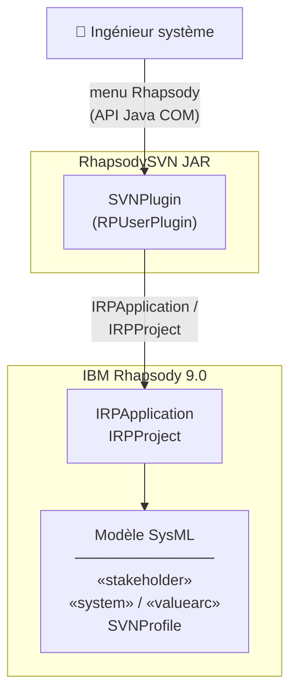

# 2. Description générale

## Environnement ou contexte du système

Le plugin **RhapsodySVN** est un composant logiciel qui s'exécute au sein de l'environnement **IBM Rhapsody 9.0**. Il
s'intègre à Rhapsody via la classe `SVNPlugin`, qui implémente l'interface `RPUserPlugin` de l'API Java COM de Rhapsody.

Il interagit avec trois entités principales :

- **IBM Rhapsody** : l'application hôte, avec laquelle le plugin communique via l'API Java COM (`RhapsodyAppServer`).
  Rhapsody doit être ouvert et un projet actif doit être chargé pour que le plugin fonctionne. Le plugin s'intègre au
  menu contextuel de Rhapsody via la classe `SVNPlugin`.

- **Le modèle SysML/UML** : le projet Rhapsody ouvert, qui contient les éléments manipulés par le plugin (acteurs
  `«stakeholder»`, classes `«system»`, flux `«valuearc»`, diagrammes `«SVNDiagram»`). Le plugin lit et modifie ce modèle
  directement via l'API Rhapsody.

- **L'utilisateur** : déclenche les commandes du plugin depuis le menu de Rhapsody ou en ligne de commande, et crée
  manuellement les éléments SVN dans le modèle.

Le schéma ci-dessous représente ces interactions :

Le plugin n'a pas de persistance propre : toutes les données (scores, stéréotypes, tags) sont stockées directement dans
le modèle Rhapsody. Il ne communique avec aucun service réseau ou base de données externe.

### Architecture en couches

Le code est organisé selon une architecture en couches :

| Couche                    | Classes                                                          | Rôle                                                                                                  |
|---------------------------|------------------------------------------------------------------|-------------------------------------------------------------------------------------------------------|
| Point d'entrée            | `SVNPlugin`, `Main`(permet de lancer le programme sans Rhapsody) | Initialisation du plugin, connexion à Rhapsody                                                        |
| Contrôleur réactif        | `Listener`                                                       | Écoute les événements Rhapsody (`afterAddElement`, `onElementsChanged`) et orchestre les mises à jour |
| Services (logique métier) | `CalculationService`, `UpdateElementService`                     | Calcul d'importance SVN et écriture des résultats dans le modèle                                      |
| Stratégies de calcul      | `ValueLoopStrategy`, `ArcSumStrategy`                            | Algorithmes interchangeables (pattern Strategy)                                                       |
| Modèles                   | `Stakeholder`, `ValueArc`, `SVNSystem`, `ValueLoop`              | Wrappers des interfaces Rhapsody                                                                      |
| Wrapper Rhapsody          | `RhapsodyWrapper`                                                | Accès bas niveau à l'API Rhapsody                                                                     |
| Constantes                | `SVNConstants`                                                   | Centralisation des noms de stéréotypes et de tags                                                     |

Le plugin adopte une architecture **réactive** : il ne repose pas sur des commandes manuelles déclenchées par l'utilisateur, mais sur un `Listener` enregistré auprès de Rhapsody qui réagit automatiquement aux modifications du modèle. Lorsqu'un arc `«valuearc»` est ajouté, qu'un de ses tags (`benefitRanking`, `supplyImportance`) est modifié, ou qu'un élément est supprimé, le `Listener` déclenche aussitôt le recalcul des scores d'importance et la mise à jour des labels dans le diagramme — sans intervention de l'utilisateur.

## Caractéristiques des utilisateurs

Ce plugin s'adresse principalement à des **ingénieurs systèmes** (professionnels ou étudiants).

| Caractéristique           | Description                                                                                                                      |
|---------------------------|----------------------------------------------------------------------------------------------------------------------------------|
| Domaine                   | Ingénierie système, modélisation SysML/UML                                                                                       |
| Outil maîtrisé            | IBM Rhapsody (utilisateur régulier)                                                                                              |
| Connaissance méthode      | Familier avec la notion de Stakeholder Value Network (SVN), les équations de Cameron (2007) et les matrices de score INCOSE 2018 |
| Fréquence d'utilisation   | Occasionnelle                                                                                                                    |
| Compétences informatiques | Intermédiaires à avancées (capable d'utiliser un outil de modélisation professionnel)                                            |

>L'utilisateur n'a pas besoin de connaître Java ni l'API Rhapsody pour utiliser le plugin : toutes les interactions
>passent par le menu graphique de Rhapsody ou par des boîtes de dialogue Swing générées par le plugin.
{style=tip}

## Les contraintes principales de développement

### Contraintes techniques

| Composant              | Contrainte                                                                             |
|------------------------|----------------------------------------------------------------------------------------|
| Langage                | Java 8                                                                                 |
| JDK                    | JDK 1.8                                                                                |
| IBM Rhapsody           | Version 9.0 obligatoire (le JAR `rhapsody.jar` utilisé est spécifique à cette version) |
| Système d'exploitation | Windows uniquement                                                                     |
| Outil de build         | Maven 3.x                                                                              |
| Dépendance externe     | `rhapsody.jar` fourni par IBM, à placer dans `lib/`                                    |

### Normes et standards

Le calcul d'importance des parties prenantes est conforme aux **équations SVN définies par [Cameron (2007)](references.md#cameron)**, qui formalisent la notion de *value loop* et le calcul du score d'importance relatif de chaque stakeholder. La pondération des arcs `«valuearc»` repose sur la **matrice de score publiée en Figure 3 de l'[INCOSE 2018](references.md#incose)**, qui associe à chaque combinaison de `benefitRanking` et `supplyImportance` une valeur numérique comprise entre 0.1 et 0.95. 

Enfin, la modélisation des entités SVN dans Rhapsody s'appuie sur des **stéréotypes SysML** définis dans un profil dédié (`SVNProfile`), conformément aux pratiques de profilage UML/SysML recommandées par l'OMG.

## Hypothèses de travail

Lors du développement du plugin, les hypothèses suivantes ont été formulées concernant l'environnement d'exécution, les données d'entrée et les comportements attendus. Le respect de ces hypothèses est crucial pour le bon fonctionnement du plugin. En cas de non-respect, des impacts fonctionnels ou des erreurs peuvent survenir.

| Hypothèse                                                                             | Impact si non respectée                                                                                             |
|---------------------------------------------------------------------------------------|---------------------------------------------------------------------------------------------------------------------|
| IBM Rhapsody 9.0 est ouvert avec un projet actif au moment du lancement               | Le plugin ne peut pas se connecter à l'API — toutes les commandes échouent                                          |
| Un package `Default` existe dans le projet Rhapsody                                   | Les commandes de création et de nettoyage ne trouvent pas leur cible                                                |
| La commande `SVN Configure` a été exécutée avant toute autre                          | Les stéréotypes et tags nécessaires (`«stakeholder»`, `«valuearc»`, `importanceScore`, etc.) sont absents du modèle |
| Des éléments `«stakeholder»`, `«system»` et `«valuearc»` ont été créés dans le modèle | `SVNCalculateCommand` ne trouve aucun nœud à traiter et ne produit aucun résultat                                   |
| L'arc `«valuearc»` cible est sélectionné graphiquement dans Rhapsody                  | `SVNEditArcCommand` et `SVNArcColorCommand` ne peuvent pas identifier l'élément à modifier                          |

[//]: # (TODO: vérifier véracité de la fonctionnalité de fallback)
En cas de modèle sans nœud `«system»`, le plugin bascule automatiquement sur un **calcul simplifié par somme des arcs** (fallback implémenté dans `CalculationService`), ce qui constitue la principale solution de repli fonctionnelle.

