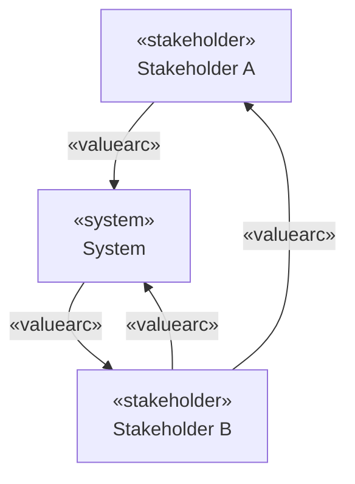

# 4. Spécification des structures de données

>Le plugin RhapsodySVN ne possède pas de base de données propre. Toutes les données sont stockées directement dans le **modèle Rhapsody** sous forme de stéréotypes, de tags et de types énumérés. Cette section décrit les entités manipulées, leurs relations et leurs attributs.
{style=warning}

## Modèle d'entités

```
 SVNProfile
 ├── Stéréotype «stakeholder»  (métaclasse Actor)
 │       └── tag: importanceScore (Float)
 ├── Stéréotype «system»       (métaclasse Class)
 ├── Stéréotype «valuearc»     (métaclasse Flow)
 │       ├── tag: benefitRanking  (BenefitRanking)
 │       └── tag: supplyImportance (SupplyImportance)
 ├── Stéréotype «SVNDiagram»   (métaclasse ObjectModelDiagram)
 ├── Type BenefitRanking       (Enumeration)
 │       ├── MIGHT_BE
 │       ├── SHOULD_BE
 │       └── MUST_BE
 └── Type SupplyImportance     (Enumeration)
         ├── LOW
         ├── MEDIUM
         └── HIGH
```

---

## Entité : «stakeholder»

| Propriété | Valeur                                                                                                                                            |
|---|---------------------------------------------------------------------------------------------------------------------------------------------------|
| **Nom** | `stakeholder`                                                                                                                                     |
| **But** | Représente une partie prenante du système (acteur humain ou organisation) dont on souhaite évaluer l'importance relative dans le réseau de valeur |
| **Métaclasse Rhapsody** | `Actor` (`IRPActor`)                                                                                                                              |
| **Profil** | `SVNProfile`                                                                                                                                      |
| **Tag** | `importanceScore` (Float, entre 0 et 1) — score d'importance calculé par [UC4](03-besoins-fonctionnels.md#uc4-calculer-l-importance-des-stakeholders)                                          |
| **Relations** | Peut être relié à d'autres `«stakeholder»` ou à un `«system»` via des arcs `«valuearc»`                                                           |

---

## Entité : «system»

| Propriété | Valeur |
|---|---|
| **Nom** | `system` |
| **But** | Représente le système central du réseau SVN. C'est le nœud de départ et d'arrivée des *value loops* utilisées dans le calcul de Cameron (2007). Un seul nœud `«system»` est attendu par modèle. |
| **Métaclasse Rhapsody** | `Class` (`IRPClass`) |
| **Profil** | `SVNProfile` |
| **Tags** | Aucun tag spécifique |
| **Relations** | Connecté aux `«stakeholder»` via des `«valuearc»` |

---

## Entité : «valuearc»

| Propriété | Valeur |
|---|---|
| **Nom** | `valuearc` |
| **But** | Représente un flux de valeur orienté entre deux entités du réseau SVN (stakeholder ↔ system ou stakeholder ↔ stakeholder). Chaque arc est pondéré par deux critères. |
| **Métaclasse Rhapsody** | `Flow` (`IRPFlow`) |
| **Profil** | `SVNProfile` |
| **Tag `benefitRanking`** | Type `BenefitRanking` — importance du bénéfice apporté par cet arc du point de vue du destinataire (`MIGHT_BE`, `SHOULD_BE`, `MUST_BE`) |
| **Tag `supplyImportance`** | Type `SupplyImportance` — capacité du fournisseur à satisfaire ce flux de valeur (`LOW`, `MEDIUM`, `HIGH`) |
| **Relations** | Orienté entre deux entités SVN : `end1` (source) et `end2` (cible) |

---

## Entité : «SVNDiagram»

| Propriété | Valeur |
|---|---|
| **Nom** | `SVNDiagram` |
| **But** | Diagramme Rhapsody dédié à la représentation visuelle d'un réseau SVN. Il regroupe les nœuds `«stakeholder»` et `«system»` et les arcs `«valuearc»`. |
| **Métaclasse Rhapsody** | `ObjectModelDiagram` (`IRPObjectModelDiagram`) |
| **Profil** | `SVNProfile` |
| **Propriété** | `DrawingToolbar` configurée pour exposer les outils `stakeholder`, `system` et `valuearc` |
| **Relations** | Contient les représentations graphiques (`IRPGraphElement`) des entités SVN |

---

## Type énuméré : BenefitRanking

| Propriété | Valeur |
|---|---|
| **Nom** | `BenefitRanking` |
| **But** | Qualifie l'importance du bénéfice que représente un arc `«valuearc»` pour son destinataire |
| **Littéraux** | `MIGHT_BE`, `SHOULD_BE`, `MUST_BE` (ordre croissant d'importance) |
| **Utilisation** | Tag `benefitRanking` du stéréotype `«valuearc»` |

---

## Type énuméré : SupplyImportance

| Propriété | Valeur |
|---|---|
| **Nom** | `SupplyImportance` |
| **But** | Qualifie la capacité du fournisseur à satisfaire le flux de valeur représenté par un arc |
| **Littéraux** | `LOW`, `MEDIUM`, `HIGH` (ordre croissant de capacité) |
| **Utilisation** | Tag `supplyImportance` du stéréotype `«valuearc»` |

---

## Profil SVNProfile

| Propriété | Valeur |
|---|---|
| **Nom** | `SVNProfile` |
| **But** | Profil SysML/UML créé dans le projet Rhapsody actif, qui regroupe tous les stéréotypes et types nécessaires au fonctionnement du plugin |
| **Contenu** | Stéréotypes `«stakeholder»`, `«system»`, `«valuearc»`, `«SVNDiagram»` ; types `BenefitRanking`, `SupplyImportance` |
| **Gestion** | Créé ou recréé par UC1. Supprimé par UC8. Stocké dans le modèle Rhapsody (pas de fichier externe). |

---

## Relations entre entités



Un réseau SVN typique comprend :
- Un nœud `«system»` central
- Plusieurs nœuds `«stakeholder»` autour
- Des arcs `«valuearc»` orientés formant des cycles (value loops) passant par le système
