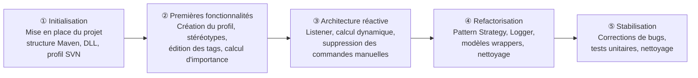

# 6. Avancement du projet

Ce chapitre constitue un mini-audit du plugin RhapsodySVN. Il évalue le niveau de maturité du projet sur cinq axes : qualité du code, maintenabilité, robustesse, sécurité et limitations connues.

---

## Historique du développement

L'historique git révèle cinq phases de développement successives :

| Phase | Commits clés |
|---|---|
| **① Initialisation** | `core: creating java project`, `a02aefe relative dll path config`, `feat: implement SVN profile creation` |
| **② Premières fonctionnalités** | `can edit Tags from ARC and stakeholder`, `feat: implement SVN profile configuration and importance calculation`, `feat: add properties to stereotypes` |
| **③ Architecture réactive** | `feat: add tags values views on elements, and dynamic calculation`, `refactor: add elements deletion handling on onElementsChanged trigger`, `chore: delete main commands` |
| **④ Refactorisation** | `feat: start extracting calculation strategies to Strategy Classes`, `refactor: move static methods from SVNConstant to RhapsodyWrapper`, `chore: move UpdateElement class to rhapsody package` |
| **⑤ Stabilisation** | `fix: diagram was null when changing arc values`, `fix: add calculation over with IRPPort`, `test: add unit test with Junit`, `chore: French comments and logs messages cleaned` |

## Qualité du code

Le code est actuellement **en cours de refactorisation**. La version initiale du projet reposait sur des commandes manuelles déclenchées depuis le menu Rhapsody (`chore: delete main commands`) ; l'architecture a depuis évolué vers un modèle réactif piloté par un `Listener`, ce qui constitue une amélioration significative de la conception.

Les responsabilités sont bien séparées entre les différentes classes : le `Listener` gère la réception des événements Rhapsody, le `CalculationService` orchestre le calcul, les stratégies (`ValueLoopStrategy`, `ArcSumStrategy`) encapsulent les algorithmes, et `RhapsodyElementUpdater` centralise l'écriture des résultats dans le modèle. Cette répartition applique le **principe de responsabilité unique**.

Le **pattern Strategy** est correctement utilisé pour rendre les algorithmes de calcul interchangeables sans modifier le code appelant. Les classes modèles (`Stakeholder`, `ValueArc`, `SVNSystem`) encapsulent proprement les interfaces Rhapsody et exposent une API cohérente.

L'architecture est désormais stabilisée : les sections UC du rapport ont été mises à jour pour refléter les classes actuelles (`RhapsodyElementUpdater` à la place de l'ancien `UpdateElementService`).

---

## Maintenabilité

La maintenabilité du projet est **bonne** pour un projet académique. Plusieurs choix techniques facilitent les évolutions futures :

- **Centralisation des constantes** : tous les noms de stéréotypes, tags et littéraux sont regroupés dans `SVNConstants`, évitant les chaînes de caractères dispersées dans le code.
- **Isolation de l'API Rhapsody** : `RhapsodyWrapper` regroupe les accès bas niveau à l'API. En cas de changement de version de Rhapsody, les adaptations sont localisées dans cette seule classe.
- **Interfaces et stratégies interchangeables** : `ICalculationService` et `ICalculationStrategy` permettent d'ajouter ou de remplacer un algorithme sans toucher au `Listener` ni au reste de l'architecture.
- **Classes courtes et ciblées** : les classes et méthodes sont relativement concises, ce qui facilite la compréhension et la modification du code.

La documentation du code est **prévue mais pas encore complète** : les commentaires Javadoc sont absents sur la majorité des méthodes. Cette lacune sera comblée en fin de projet pour assurer une meilleure transmission du code.

---

## Robustesse et fiabilité

Le projet dispose désormais d'une **suite de tests JUnit** couvrant les parties algorithmiques critiques :

| Classe de test | Ce qui est couvert |
|---|---|
| `SearchStateTest` | Logique de l'état de recherche DFS (value loops) |
| `ValueArcScoreTest` | Matrice de scores INCOSE (BenefitRanking × SupplyImportance) |
| `ValueLoopTest` | Calcul du score d'un value loop (produit des arcs) |
| `ImportanceCalculationTest` | Calcul d'importance end-to-end (équations Cameron) |

Ces tests couvrent la couche algorithmique pure (modèles et stratégies) sans dépendance à l'API Rhapsody, ce qui les rend exécutables en dehors de l'environnement IBM. La couche d'intégration (interaction avec Rhapsody via `IRPApplication`) reste non testée automatiquement : elle est validée uniquement par tests manuels.

Les principaux mécanismes de protection en place sont :
- Les opérations API Rhapsody sont systématiquement encadrées par des blocs `try/catch` avec log d'erreur, évitant toute exception non gérée susceptible de planter Rhapsody.
- L'absence de nœud `«system»` est gérée par un fallback automatique vers `ArcSumStrategy`.
- Les tags absents ou invalides sont traités avec des valeurs par défaut via `RhapsodyWrapper.initTagIfAbsent()`.
- Les notifications Rhapsody sont désactivées (`setNotifyPluginOnElementsChanged(0)`) pendant les opérations d'écriture pour éviter les boucles d'événements.

---

## Sécurité

Le plugin présente une **surface d'attaque très limitée**. Il ne communique avec aucun service réseau, ne lit ni n'écrit aucun fichier externe, et ne manipule aucune donnée sensible (mots de passe, données personnelles, jetons d'authentification).

Toutes les données (scores, tags, stéréotypes) sont stockées exclusivement dans le modèle Rhapsody ouvert. L'accès au plugin est restreint à la machine locale : il ne peut être déclenché que depuis IBM Rhapsody ou en ligne de commande, sans exposition d'API externe.

Les valeurs de tags reçues depuis le modèle sont traitées défensivement : toute valeur absente, nulle ou non reconnue est remplacée par une valeur par défaut sans lever d'exception. Le plugin ne fait pas confiance aux données du modèle et les valide avant usage.

---

## Limitations connues

| Limitation | Impact |
|---|---|
| **Couplage à Rhapsody 9.0** | Le JAR `rhapsody.jar` est spécifique à cette version. Une migration vers une version ultérieure de Rhapsody nécessiterait de revalider l'ensemble des appels API. |
| **Windows uniquement** | La DLL native `rhapsody.dll` requise par l'API Java COM n'existe que pour Windows. Le plugin ne peut pas être exécuté sur Linux ou macOS. |
| **Couverture de tests partielle** | Les tests JUnit couvrent la logique algorithmique, mais la couche d'intégration Rhapsody (`Listener`, `RhapsodyWrapper`, `RhapsodyElementUpdater`) reste non couverte — l'API Rhapsody ne peut pas être mockée sans une vraie instance IBM. |
| **Usage de `IRPDependency` au lieu de constructs SysML** | Les arcs `«valuearc»` sont modélisés comme des `IRPDependency` (dépendance UML générique) plutôt que comme des `IRPConnector` ou des associations de blocs SysML. Cela s'éloigne de la sémantique IBD/BDD attendue pour un diagramme SVN correct en SysML. |