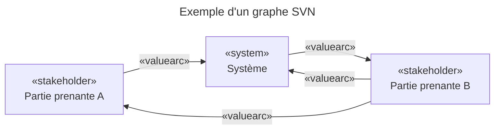

# A. Fondements théoriques — La méthode SVN

## Qu'est-ce qu'un Stakeholder Value Network ?

Un **Stakeholder Value Network (SVN)** est une méthode d'analyse des parties prenantes proposée par [Cameron (2007)](X-references.md#cameron). Elle modélise les relations entre un système et ses parties prenantes sous la forme d'un **graphe orienté pondéré**, dans lequel chaque arc représente un flux de valeur entre deux entités.

Contrairement aux approches classiques qui se contentent d'identifier les parties prenantes et leurs besoins, la méthode SVN cherche à **quantifier l'importance relative** de chaque partie prenante en tenant compte de la structure des échanges de valeur au sein du réseau. Cette quantification permet d'établir un classement objectif des parties prenantes, utile pour prioriser les exigences et guider les arbitrages architecturaux.

Dans une démarche MBSE, le SVN se positionne en **amont de la définition des exigences** : il fournit une base quantitative pour déterminer quelles parties prenantes doivent être satisfaites en priorité, et donc quelles fonctions du système sont les plus critiques.

## Structure d'un graphe SVN

Un réseau SVN est composé de trois types d'entités :

- **Le nœud `«system»`** : représente le système en cours de conception. C'est le nœud central autour duquel gravitent les parties prenantes. Il joue un rôle particulier dans le calcul des scores.
- **Les nœuds `«stakeholder»`** : représentent les parties prenantes (acteurs humains ou organisations) qui interagissent avec le système. Chaque stakeholder reçoit un score d'importance calculé par la méthode.
- **Les arcs `«valuearc»`** : représentent les flux de valeur orientés entre entités. Chaque arc est pondéré par deux critères : le `benefitRanking` (importance du bénéfice pour le destinataire) et le `supplyImportance` (capacité du fournisseur à satisfaire ce flux).

## Les value loops

Le concept central de la méthode est la **value loop** : un cycle dans le graphe SVN qui passe par le nœud `«system»`. Une value loop représente un circuit de valeur complet — le système reçoit quelque chose d'un acteur et le restitue (directement ou indirectement) à un ou plusieurs autres acteurs.

Plus un stakeholder participe à de nombreuses value loops, et plus ces loops ont un score élevé, plus ce stakeholder est considéré comme important pour le système. La méthode de Cameron formalise cette intuition à travers deux équations.

## Calcul de l'importance — Équations de Cameron (2007)

### Score d'un arc

Chaque arc `«valuearc»` reçoit un score numérique déterminé par la combinaison de ses deux attributs de pondération. La matrice ci-dessous, issue de la Figure 3 de [Sease et al. (INCOSE 2018)](X-references.md#incose), définit ces scores :

| `supplyImportance` ↓ \ `benefitRanking` → | `MIGHT_BE` | `SHOULD_BE` | `MUST_BE` |
|---|---|---|---|
| `HIGH` | 0.35 | 0.65 | 0.95 |
| `MEDIUM` | 0.20 | 0.35 | 0.65 |
| `LOW` | 0.10 | 0.20 | 0.35 |

Les valeurs par défaut à la création d'un arc sont `MIGHT_BE` et `LOW`, soit un score de **0.10**.

### Équation 1 — Score d'une value loop

Le score d'une value loop est le **produit des scores de tous ses arcs** :

$$\text{score}(L) = \prod_{i} \text{score}(\text{arc}_i)$$

Un seul arc de faible valeur dans une loop suffit à réduire significativement son score global, ce qui reflète l'idée qu'une chaîne de valeur n'est aussi forte que son maillon le plus faible.

### Équation 2 — Importance d'un stakeholder

L'importance d'un stakeholder S est calculée comme la **fraction des scores de loops qui le contiennent**, rapportée au score total de toutes les loops du réseau ([Cameron 2007](X-references.md#cameron), Équation 2) :

$$\text{importance}(S) = \frac{\displaystyle\sum_{L \ni S} \text{score}(L)}{\displaystyle\sum_{L} \text{score}(L)}$$

Le résultat est un score normalisé entre 0 et 1. Un stakeholder présent dans toutes les loops de fort score obtiendra un score proche de 1 ; un stakeholder isolé ou présent uniquement dans des loops de faible valeur obtiendra un score proche de 0.