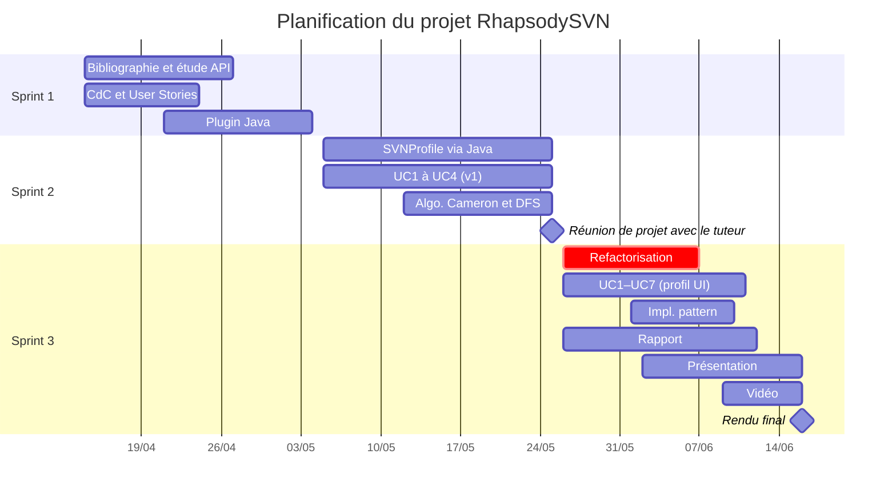

# B. Planification et déroulement du projet

## Organisation générale

Le projet a été conduit selon une méthodologie **Agile Scrum**, découpée en **3 sprints de 3 semaines** du 14 avril au 16 juin 2026. Chaque sprint est encadré par un sprint planning en ouverture et une rétrospective en clôture. Le backlog est géré sur **ClickUp**.

| Rôle | Membre |
|---|---|
| Product Owner | Guillaume Retter |
| Scrum Master | Arnaud Michel |
| Développeurs | Hugo Charcot, Benjamin Groisne, Antoine Laurant |

## Diagramme de Gantt

## Déroulement par sprint

### Sprint 1 — Exploration et mise en place (14 avril – 5 mai)

Le premier sprint a été consacré à l'installation et la prise en main de Rhapsody. 

L'équipe a également débuté par réaliser une phase de recherche sur la méthode SVN et d'étude approfondie de l'API Java COM d'IBM Rhapsody, peu documentée. En parallèle, le cahier des charges et les premières User Stories ont été rédigés.

Un **POC** a été réalisé en fin de sprint : tentative de création du plugin et du profil SVN entièrement par code Java. Cette exploration a révélé une limitation importante de l'API — il est impossible de créer de nouveaux types de diagrammes depuis Java seul. Ce constat a orienté les choix architecturaux du sprint suivant.

### Sprint 2 — Première implémentation (5 mai – 26 mai)

Le deuxième sprint a produit une première version fonctionnelle du plugin. Le profil `SVNProfile` (stéréotypes, types énumérés, tag values) a été créé via l'API Java, et les quatre premiers cas d'utilisation [(UC1 à UC4)](02-besoins-fonctionnels.md) ont été implémentés en version initiale, incluant l'algorithme DFS de détection des value loops et le calcul des scores de Cameron.

En fin de sprint, après un entretien avec l'enseignant référent, un retour important a conduit à un changement majeur architectural : il a été recommandé de définir le profil SVN depuis l'interface graphique de Rhapsody plutôt que par code. Cette approche offre une meilleure compatibilité et facilite la maintenance. Ce changement a été intégré comme tâche critique du Sprint 3.

### Sprint 3 — Refactorisation, architecture réactive et livrables (26 mai – 16 juin)

Le troisième sprint a été le plus dense. Il a débuté par une **refactorisation majeure** : 
- suppression de la création programmatique du profil
- réimplémentation de l'ensemble des UC sur la base du profil défini dans l'interface Rhapsody en récupérant les bases du profil générées par l'API Java.

L'architecture a simultanément évolué vers un modèle **event-driven** avec l'introduction du `Listener` (`RPApplicationListener`), qui déclenche automatiquement le recalcul à chaque modification du modèle. Le **pattern Strategy** a été mis en place pour rendre les algorithmes de calcul interchangeables. Des **tests unitaires** ont été ajoutés pour couvrir la logique algorithmique. 

Le sprint s'est conclu par la production des livrables finaux : le présent rapport, les supports de présentation ainsi que la vidéo explicative.